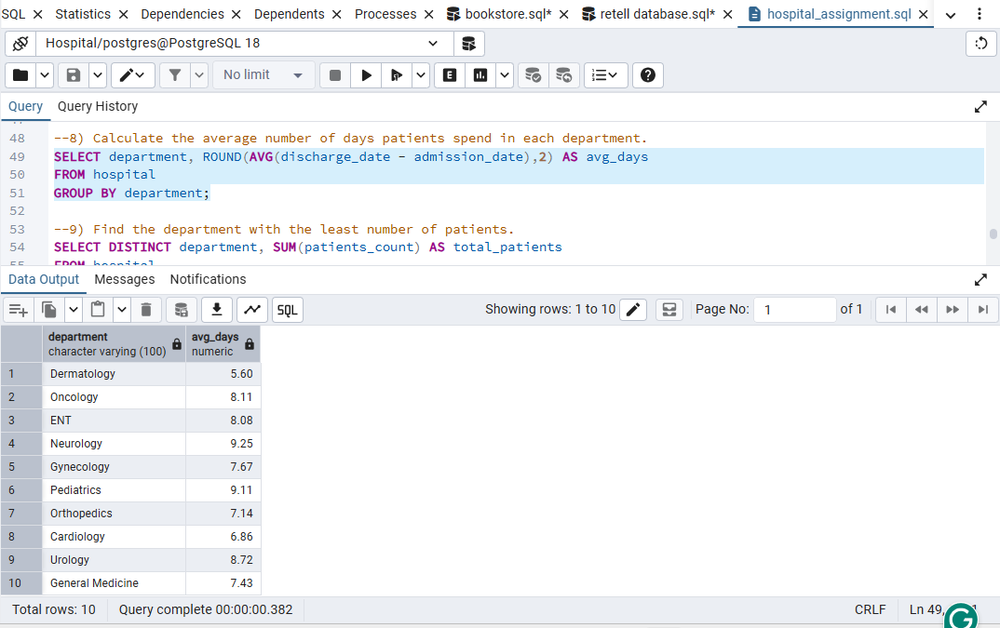
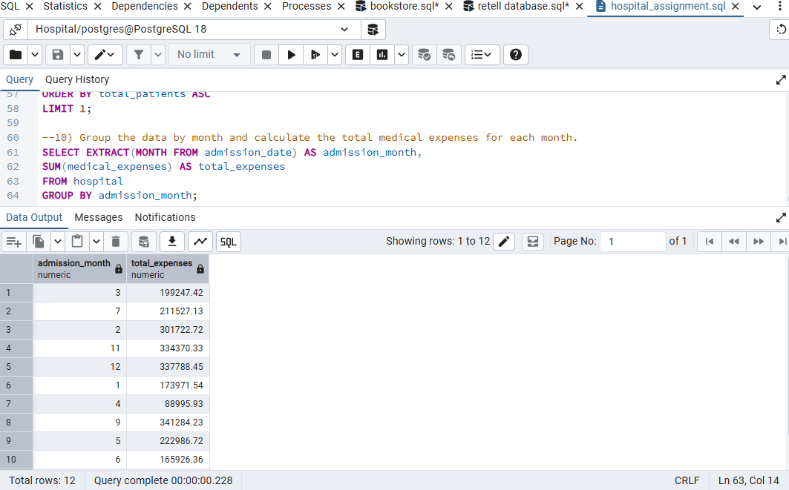
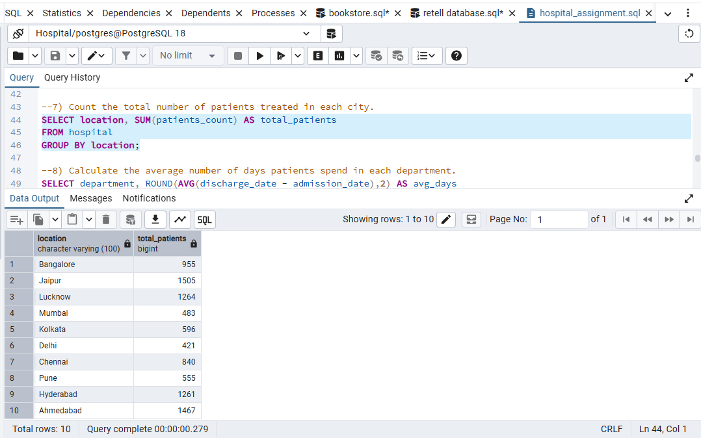

# Hospital SQL Assignment

## Project Title / Headline

🏥 **Hospital Database Analysis using PostgreSQL**
A SQL project focused on analyzing hospital data by solving real-world business queries using PostgreSQL.

## Short Description / Purpose

This SQL project focuses on querying and analyzing a hospital database to extract meaningful business insights. It demonstrates the use of SQL for data retrieval, aggregation, filtering, grouping, date functions, and analytical problem-solving to support data-driven decision-making.

## Tech Stack

The project was built using the following tools and technologies:

* 🐘 **PostgreSQL** – Database management system used to store and manage the data.
* 💻 **pgAdmin 4** – Used for writing, executing, and managing SQL queries.
* 📝 **SQL** – Used for data retrieval, aggregation, grouping, sorting, filtering, and date-based analysis.
* 📄 **File Format** – `.sql` for SQL queries and `.pdf` for the assignment solution.

## Data Source

The dataset consists of hospital records containing information about hospitals, departments, doctors, patient count, admission and discharge dates, and medical expenses. The data was imported into PostgreSQL for analysis.

## Features / Highlights

### Business Problem

Healthcare organizations need to analyze patient statistics, hospital performance, department-wise trends, and medical expenses to support operational and strategic decision-making. SQL enables efficient analysis of this data by transforming raw records into meaningful insights.

### Goal of the Project

* Analyze hospital and department performance.
* Calculate patient and doctor statistics.
* Evaluate medical expenses.
* Analyze patient stay duration.
* Generate monthly expense reports.
* Answer real-world business questions using SQL.

   ## 📸 Screenshots

### Average days spent by patients in each department

### Monthly medical expenses

### Patients treated in each city

### Key SQL Concepts Used

* SELECT & WHERE
* ORDER BY & LIMIT
* GROUP BY
* Aggregate Functions (SUM, AVG)
* Date Functions
* Aliases
* Arithmetic Operations

## Business Impact & Insights

* Identified hospitals and departments with the highest patient load.
* Compared medical expenses across hospitals.
* Analyzed average patient stay duration by department.
* Generated monthly medical expense trends.
* Strengthened SQL skills by applying aggregate functions, grouping, sorting, and date-based analysis to solve practical business problems.
